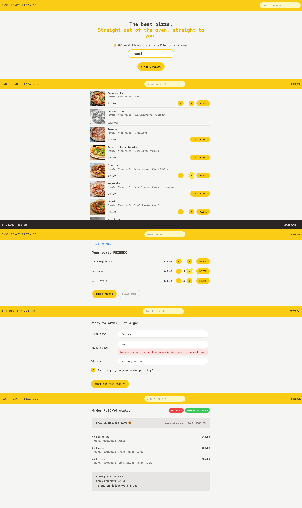

# <span align="center"><samp>Fast React Pizza Co.</samp></span>

Single Page Application (SPA) for online pizza ordering. The project simulates working on a real client request: analyzing business requirements, defining features, planning architecture, selecting technologies, and implementing the solution.

This project is based on [_The Ultimate React Course 2025: React, Next.js, Redux & More_](https://www.udemy.com/course/the-ultimate-react-course/) by Jonas Schmedtmann. Educational repository, not intended for production use.

## Demo



## Features

- Dynamic pizza menu fetched from an API
- Shopping cart with add, update, and remove functionality
- Order form: name, phone, address, optional GPS location
- Priority orders (+20% fee)
- Track order status by unique ID assigned to each order

## Tech Stack

- **React 18** + **Vite 4**
- **React Router v6.4+** - routing, loaders, actions, remote state
- **Redux Toolkit** - global state management
- **Tailwind CSS** - styling

## Pages

- `/` – start page (enter user name)
- `/menu` – pizza menu
- `/cart` – shopping cart
- `/order/new` – create a new order
- `/order/:id` – check the status of an existing order

## Project structure

The app follows a **feature-based structure** for scalability and maintainability:

```bash
src/
├─ features/       # feature domains (user, menu, cart, order)
├─ ui/             # reusable UI components (buttons, inputs, pages)
├─ services/       # API interaction (pizza API, geocoding)
├─ utils/          # pure helper functions (date, currency, calculations)
├─ index.css
└─ main.jsx
```

Each feature folder contains all related components, slices, and logic.
This co-location keeps code organized, avoids unnecessary jumping across files, and mirrors real-world project setups.

## Installation

```bash
# 1. Clone the repository
git clone https://github.com/zeglicz/fast-react-pizza.git

# 2. Navigate into the project folder
cd fast-react-pizza

# 3. Install dependencies
npm install

# 4. Start the development server
npm run dev

# 5. Build for production
npm run build && npm run preview
```
